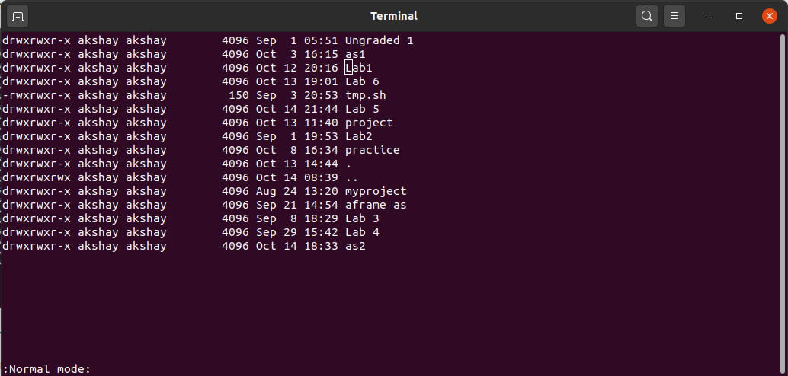
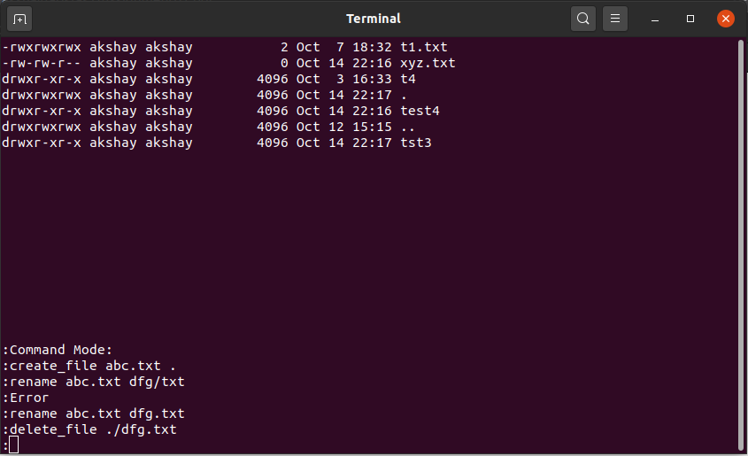

# Linux Terminal Based File Explorer

### Prerequisites

1. G++ compiler
   - `sudo apt-get install g++`

### How to compile project

1. go to project directory and run following command
   - `make`
2. To clean solution
   - `make clean`

### How to Run project

1. Open the explorer in the current directory:
   - `./main`
2. Open the explorer in any directory:
   - `./main directory_path`

### Functionality 

The file explorer can work in two modes, normal mode and command mode.
The application starts in normal mode, which is the default mode and used to explore the current directory and navigate around in the filesystem.
<br/>
The root/home of the application is the directory where the application started.
<br/>
The last line of the display screen is to be used as status bar - to be used in normal and command modes.

### 1. Normal Mode:

**1.1 Read and display list of files and directories in the current folder**

- File explorer shows each file/directory in the current directory (one entry per line). The following attributes are visible for each file (similar to what gets displayed on ls -l)

  - File/Directory Name
  - Ownership (User & Group) & Permissions
  - File/Directory size
  - Last modified

- The File explorer also handle scrolling using 'k' and 'l' keys in case the directory has a lot of files. Press 'l' to view the next set of files and 'k' to view the previous set of files.
- The file explorer also show the entries “.” & “..” for current and parent directory respectively.
- User can navigate up & down the file list using corresponding arrow keys.



**1.2 Open files & directories**

- When enter is pressed
  - Directory​ - It will clear the screen and Navigate into the directory and shows the files & directories inside it as specified in point 1
  - Files​ - It will open the file in vi editor.
  
**1.3 Traversal**
- Go back - Left arrow key takes the user to the previously visited directory.
- Go forward - Right arrow key takes the user to the next directory.
- Up one level - Backspace key takes the user up one level
- Home - ​h​ key takes the user to the home folder 

### 2. Command Mode:

The application enters the command mode whenever the `:` (colon) key
is pressed.
<br/>
Upon entering the command mode the user can enter different commands. All commands entered by the user appears at the bottom of the terminal.



**2.1 copy, move and rename**

```
copy <source_file(s)> <destination_directory>
move <source_file(s)> <destination_directory>
rename <old_filename> <new_filename>
```

```
Eg:
copy foo.txt bar.txt baz.mp4 ~/foobar
move foo.txt bar.txt baz.mp4 ~/foobar
rename foo.txt bar.txt
```

Directories can also be copied/moved and the file ownership/permissions will remain intact.

**2.2 create files and directories**

```
create_file <file_name> <destination_path>
create_dir <dir_name> <destination_path>
```

```
Eg:
create_file foo.txt ~/foobar
create_file foo.txt .
create_dir folder_name ~/foobar
```

**2.3 delete files and directories**

```
delete_file <file_path>
delete_dir <directory_path>
```

```
Eg:
delete_file ~/foobar/foo.txt.
delete_dir ~/foobar/folder_name
```

**2.4 goto**

```
goto <directory_path>
```

```
Eg:
goto /home/aos/
goto ~
```

**2.5 Search a file or folder given fullname.**

```
search <file_name> or search <directory_name>
```

Eg:
search foo.txt

**2.6 On pressing ‘ESC’ key the application will go to Normal Mode**
